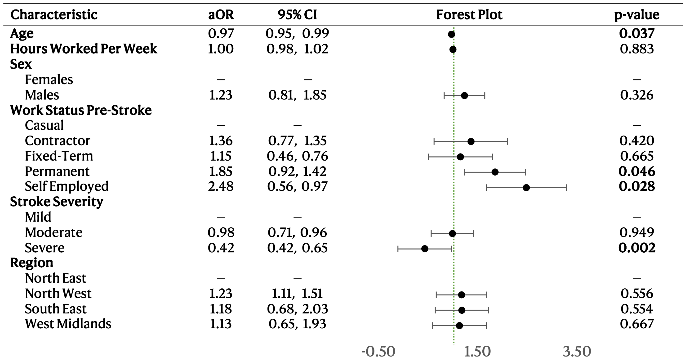
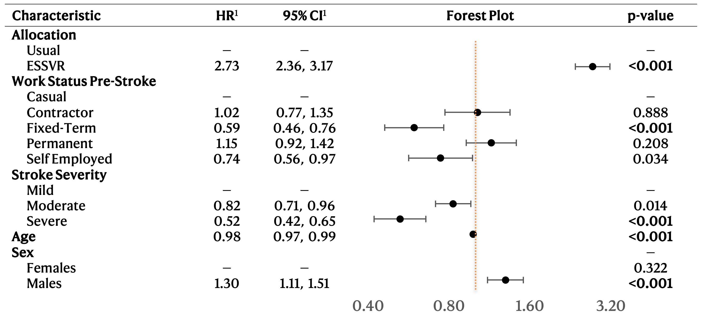

# 🧠 Stroke Rehabilitation and Return-to-Work Analysis

This project investigates the effectiveness of an Early Stroke Specialist Vocational Rehabilitation (ESSVR) programme in improving return-to-work (RTW) rates and health outcomes among stroke survivors. Using randomized controlled trial (RCT) data, we analyze the clinical, demographic, and occupational factors that influence programme success, long-term reintegration into employment, and post-stroke quality of life.

## 📍 Background

Stroke is one of the leading causes of disability in the UK and globally. In England alone, ~60,000 people experience a stroke annually, and about 40% of these are of working age (18–69 years). Fewer than half return to work, which may lead to loss of income, identity, and psychosocial well-being.

ESSVR is a structured intervention delivered by occupational therapists. It involves:
- Individual assessment of stroke-related challenges at work
- Employer and family education
- Work preparation and skills practice
- Planning and monitoring phased return-to-work pathways

The trial compared ESSVR (plus usual care) against usual care alone in 1,058 participants over a 12-month period.

---

## 📁 Dataset Overview

Key variables include:
- **Demographics**: `sex`, `age`, `region`
- **Occupation pre-stroke**: `work_status_pre`, `hpw_pre` (hours per week)
- **Clinical**: `stroke_severity`
- **Trial arm**: `alloc` (ESSVR or usual care)
- **Outcomes**:
  - `rtw_flg` and `rtw_dte` (return-to-work status and date)
  - `health_score` (composite score at 12 months)
  - `essvr_complete_flg` (ESSVR completion for intervention group)

---

## 🧪 Objectives & Analysis Strategy

The analysis is divided into three main aims, implemented in `scripts/main_analysis.R`.

### ✅ **Aim 1 – Predictors of ESSVR Completion**

We analyzed which pre-stroke factors predict whether participants allocated to ESSVR completed the full programme. 

**Approach**:
- Logistic regression on ESSVR participants only
- Key predictors: age, stroke severity, sex, work status, hours worked

**Key Findings**:
- Permanent (aOR = 1.88) and self-employed (aOR = 2.52) participants had higher odds of completion
- Severe stroke reduced completion likelihood (aOR = 0.43)
- Age negatively correlated with completion (aOR = 0.97 per year)

### 🔁 **Aim 2 – Return to Work Outcomes**

We examined how ESSVR impacts the timing and likelihood of returning to work.

**Approach**:
- Cox proportional hazards model
- Time-split analysis: 0–6 months vs. 6–12 months post-stroke
- Stratified models by sex

**Key Findings**:
- No ESSVR benefit in first 6 months (HR = 1.35, p = 0.319)
- Significant RTW benefit between 6–12 months (HR = 2.00, p = 0.028)
- Fixed-term workers returned less (HR = 0.62), and men had higher RTW rates

### 💙 **Aim 3 – Health and Quality of Life**

We evaluated whether ESSVR improves self-reported health (composite score 0–100) at 12 months.

**Approach**:
- Linear regression
- Adjusted for age, stroke severity, region, and work status
- Stratified by sex

**Key Findings**:
- ESSVR had no statistically significant effect on health score (β = 1.38, p = 0.10)
- Moderate and severe strokes associated with significant score reductions (up to −8.3 points)
- Older age linked to lower scores, especially in men

---

## 📊 Code Summary

All analysis is performed in R (`main_analysis.R`) using:

- `glm()` for logistic and linear regressions
- `coxph()` from the `survival` package for time-to-event analysis
- `survSplit()` for time interval partitioning
- `ggsurvplot()` and `forestplot()` for visualization
- Complete-case analysis used to handle inconsistencies

---
## 📊 Key Results Summary

### Table 1: Participant Characteristics by Trial Arm

| Variable                 | Overall (N=1002) | Usual Care (N=481) | ESSVR (N=521) |
|--------------------------|------------------|---------------------|---------------|
| **Age (median, IQR)**    | 62 (55–65)       | 62 (56–66)          | 62 (56–67)    |
| **Hours Worked/Week**    | 40 (25–45)       | 40 (30–45)          | 40 (25–45)    |
| **Male**                 | 652 (65%)        | 311 (65%)           | 341 (65%)     |
| **Female**               | 350 (35%)        | 170 (35%)           | 180 (35%)     |
| **Stroke Severity**      |                  |                     |               |
| – Mild                   | 431 (43%)        | 215 (45%)           | 216 (41%)     |
| – Moderate               | 420 (42%)        | 197 (41%)           | 223 (43%)     |
| – Severe                 | 151 (15%)        | 69 (14%)            | 82 (16%)      |

### Table 2: Logistic Regression – Predictors of ESSVR Completion

| Predictor               | Adjusted OR | 95% CI           | p-value |
|------------------------|-------------|------------------|---------|
| Permanent              | 1.88        | 1.06 – 3.33      | 0.031   |
| Self-Employed          | 2.52        | 1.18 – 5.60      | 0.019   |
| Severe Stroke          | 0.43        | 0.25 – 0.73      | 0.002   |
| Age (per year)         | 0.97        | 0.94 – 0.99      | 0.037   |

### Table 3: Cox Model – Return to Work

| Variable                       | HR    | 95% CI          | p-value |
|--------------------------------|-------|------------------|---------|
| ESSVR (0–6 months)             | 1.35  | 0.74 – 2.27      | 0.319   |
| ESSVR (6–12 months)            | 2.00  | 1.10 – 3.56      | 0.028   |
| Fixed-Term Contract            | 0.62  | 0.48 – 0.79      | <0.001  |
| Severe Stroke                  | 0.53  | 0.43 – 0.66      | <0.001  |
| Age (per year)                | 0.98  | 0.97 – 0.99      | <0.001  |
| Male (vs. Female)              | 1.26  | 1.09 – 1.47      | 0.002   |

### Table 4: Linear Model – Health Score at 12 Months

| Variable          | Effect Estimate (β) | 95% CI            | p-value |
|------------------|----------------------|-------------------|---------|
| ESSVR             | 1.38                 | −0.3 to 3.1       | 0.100   |
| Moderate Stroke   | −4.6                | −6.4 to −2.8      | <0.001  |
| Severe Stroke     | −8.3                | −10.9 to −5.7     | <0.001  |
| Age               | −0.16               | −0.27 to −0.05    | 0.002   |

---

## 📈 Figures

  <table>
    <tr>
      <td align="center">
         
        <em>Figure 1. Forest plot of odds ratios for return to work.</em>
      </td>
      <td align="center">
         
        <em>Figure 2. Forest plot of hazard ratios for return to work.</em>
      </td>
    </tr>
  </table>

---

## 📌 Conclusion

This study demonstrates that ESSVR significantly increases return-to-work success in the 6–12 month post-stroke period but has limited impact on overall health scores. Understanding the nuances of stroke severity, age, and employment context can inform more targeted rehabilitation policies.

---

## 📚 Citation

If using this repository or findings, please cite:

> Meléndez, A. *Effectiveness of an Early Vocational Rehabilitation Programme to Support Return to Work for Stroke Survivors*. Imperial College London, 2025.

